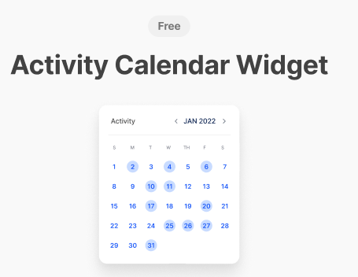
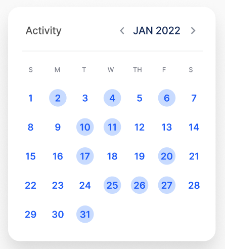

# Activity Calendar Widget.

One of my personal Qt based project to showcase my long honed skills in Python-bindings for Qt (C++) : PyQt, PySide.

## Usage

```bash
pip install activity_calendar_widget
```

```python
from activity_calendar_widget import ActivityCalendarWidget

# more is coming
```

## Figma Link

https://www.figma.com/community/file/1153390420369492172

credits to [Lindsay](https://www.figma.com/@lho)

## Images

- 
- 